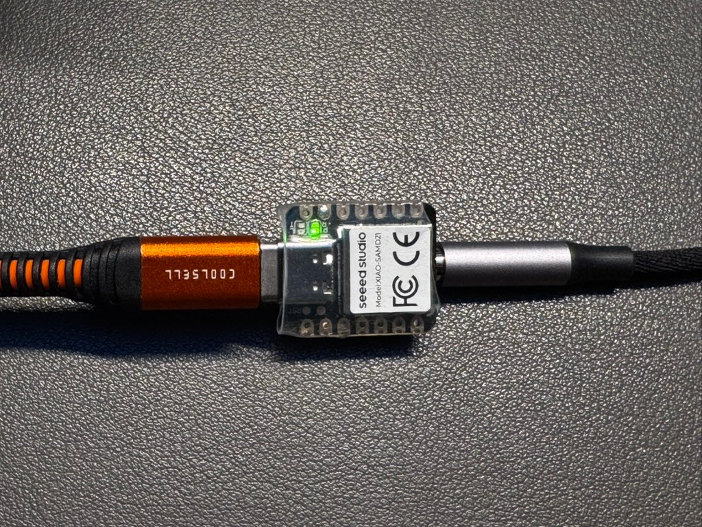
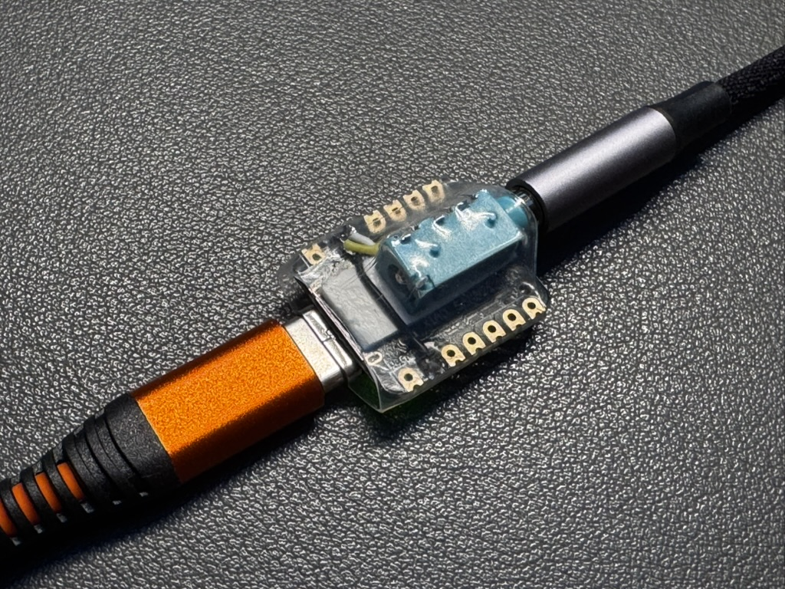

# XIAO vband adapter

A DIY USB paddle interface for Morse practice, built on the
[Seeed Studio XIAO SAMD21](https://www.seeedstudio.com/Seeeduino-XIAO-Arduino-Microcontroller-SAMD21-Cortex-M0+-p-4426.html).
Plug your iambic paddle (or straight key) into a 3.5 mm jack, plug the XIAO
into a computer or phone, and it shows up as a USB keyboard:

| Paddle contact | Jack    | XIAO pin | Key sent      |
|----------------|---------|----------|---------------|
| Dit            | Tip     | D1       | Left Ctrl     |
| Dah            | Ring    | D2       | Right Ctrl    |
| Common         | Sleeve  | GND      | —             |

This is the same key mapping as the commercial
[vband USB adapter](https://hamradio.solutions/vband/), so it works with:

- **[vband](https://hamradio.solutions/vband/)** — the virtual CW band in the
  browser. vband accepts Left/Right Ctrl as well as `[` / `]`.
- **[Next CW Trainer](https://github.com/ckonecny/next_cw_trainer)** — Android
  Morse trainer; connect via USB‑C/OTG and use *Settings → Learn Paddle Keys*.
- Any other software that reads dit/dah as two keyboard keys.

| Top side | Jack side |
|---|---|
|  |  |

The finished adapter: a 3.5 mm jack mounted on the back of the XIAO, wired
with short wires and wrapped in clear heat-shrink tubing. USB‑C on one end,
paddle on the other.

The adapter only reports *contact state*. Keyer logic (iambic A/B, ultimatic,
bug, straight key, speed) runs in the application, just like with the original
vband adapter.

## Features

- Native USB HID keyboard, no driver needed (Windows, macOS, Linux, Android,
  ChromeOS).
- Layout-independent default keys (Ctrl) — works with German, French, … host
  keyboard layouts.
- 5 ms debounce, no blocking delays: fine for high speeds (a dit at 50 WPM is
  24 ms).
- Paddle swap at power-up (hold dit while plugging in) or at compile time.
- Straight key with a mono plug works: the ring shorted to ground is detected
  and ignored, so no Ctrl key gets stuck.
- Stuck-contact protection: a contact closed for more than 10 s is released.
- On-board LED lights while a paddle is closed.

## Hardware

- Seeed Studio XIAO SAMD21 (Seeeduino XIAO)
- 3.5 mm stereo (TRS) jack or jack breakout board
- 3 wires (optionally: 2 × 220 Ω resistors, see the wiring guide)
- USB‑C cable (USB‑C ↔ USB‑C for Android phones)

**Wiring:** see **[docs/WIRING.md](docs/WIRING.md)**.

## Building and flashing

### Arduino IDE

1. *File → Preferences → Additional boards manager URLs*, add
   `https://files.seeedstudio.com/arduino/package_seeeduino_boards_index.json`
2. *Tools → Board → Boards Manager*, install **Seeed SAMD Boards**.
3. *Library Manager*: install **Keyboard** (by Arduino), if not present.
4. Open `firmware/xiao_vband/xiao_vband.ino`.
5. Select board **Seeeduino XIAO** and its port, then *Upload*.

### PlatformIO

```bash
pio run -t upload
```

`platformio.ini` pins a newer ARM toolchain (GCC 12.3) because the platform
default is x86_64 only and fails on Apple Silicon Macs without Rosetta. For
uploading on such a Mac, see the UF2 method below.

> PlatformIO's `.ino` preprocessing fails if the project path contains spaces.
> Clone into a path without spaces.

### Flashing via UF2 (Apple Silicon without Rosetta)

PlatformIO's upload tool `bossac` is x86_64 only as well, so on an Apple
Silicon Mac without Rosetta `pio run -t upload` fails with
`Bad CPU type in executable`. The XIAO's bootloader can also be flashed by
copying a `.uf2` file onto the USB drive it shows up as, which needs no
upload tool at all:

1. Build the firmware:

   ```bash
   pio run
   ```

2. Put the XIAO into bootloader mode: double-tap the RST pads (see below).
   A drive named **Arduino** appears.
3. Convert and copy in one go:

   ```bash
   python3 tools/bin2uf2.py --flash
   ```

   The drive disappears and the XIAO restarts with the new firmware.

[`tools/bin2uf2.py`](tools/bin2uf2.py) only needs Python 3. Without
`--flash` it just writes `.pio/build/seeed_xiao/firmware.uf2`, which you can
drag onto the drive yourself. If the drive is mounted somewhere else, pass
its path: `--flash /path/to/Arduino`.

### If the XIAO does not show up for upload

Double-tap the reset: briefly short the two **RST** pads next to the USB
connector twice in quick succession. The orange LED pulses and the XIAO
appears as a USB drive (**Arduino**) and a bootloader port. Upload again,
or use the UF2 method above.

## Usage

1. Plug the paddle into the jack **first**, then connect USB.
2. The yellow LED blinks once: ready. Two blinks: paddles swapped.
3. Press a paddle — the yellow LED lights up while the contact is closed.

### Swapping dit and dah

- **Temporarily:** hold the **dit** paddle while connecting USB. The LED blinks
  twice; the swap lasts until the adapter is unplugged.
- **Permanently:** set `SWAP_PADDLES` to `1` in the sketch (or as a build flag).
- Alternatively, most applications (including vband) have a "flip paddles"
  option.

### Straight key

Use a straight key with either a mono (TS) or stereo (TRS) plug. The key
contact is on the tip and sends Left Ctrl. With a mono plug the ring is
shorted to ground; the adapter notices that at power-up and ignores it. In
vband select *Straight Key/Cootie* in the settings.

### vband

Open <https://hamradio.solutions/vband/>, choose your keyer mode in the
settings (Iambic A/B, Ultimatic, Straight Key, Bug) and set the speed there.
Click into the page once so the browser tab has keyboard focus.

### Next CW Trainer (Android)

Connect the XIAO directly with a USB‑C ↔ USB‑C cable (or USB‑A cable + OTG
adapter). Open *Settings → Learn Paddle Keys* and press dit, then dah.
On Samsung phones, switch off *Auto Blocker* first, otherwise the adapter
is ignored (see [Troubleshooting](#troubleshooting)).

## Checking it works without any app

Open a keyboard event viewer, e.g.
<https://w3c.github.io/uievents/tools/key-event-viewer.html>, and press the
paddles. You should see `keydown`/`keyup` with `code` = `ControlLeft` for dit
and `ControlRight` for dah.

## Troubleshooting

### The LED reacts to the paddle, but the phone does nothing

The LED only proves that the adapter is powered and sees the paddle. If the
host ignores it, check the phone:

- **Samsung Galaxy: turn off Auto Blocker.** One UI's *Auto Blocker* option
  *Block commands and software updates by USB cable* also blocks USB
  keyboards. The adapter is powered (LED works), but the phone never accepts
  it as a keyboard. Go to *Settings → Security and privacy → Auto Blocker*
  and switch that option (or Auto Blocker as a whole) off, then replug the
  adapter. Confirmed on a Galaxy S25+. Other vendors may have similar
  USB-security features.
- **Use a data cable.** Charge-only USB‑C cables power the adapter but carry
  no data.
- **Check with the key event viewer** (see above) in Chrome before blaming
  the app. If it shows `ControlLeft`/`ControlRight`, the adapter works.
- **vband:** use Chrome and click into the page once so it has keyboard focus.
- **Next CW Trainer:** run *Settings → Learn Paddle Keys* first.

## Configuration

All options are `#define`s at the top of
[`firmware/xiao_vband/xiao_vband.ino`](firmware/xiao_vband/xiao_vband.ino) and
can also be set as `-D` build flags in `platformio.ini`:

| Option          | Default          | Meaning                                    |
|-----------------|------------------|--------------------------------------------|
| `PIN_DIT`       | `1` (D1)         | Input pin for the dit contact (jack tip)   |
| `PIN_DAH`       | `2` (D2)         | Input pin for the dah contact (jack ring)  |
| `KEY_DIT`       | `KEY_LEFT_CTRL`  | Key sent for dit                           |
| `KEY_DAH`       | `KEY_RIGHT_CTRL` | Key sent for dah                           |
| `SWAP_PADDLES`  | `0`              | `1` swaps dit and dah                      |
| `DEBOUNCE_MS`   | `5`              | Debounce time in ms                        |
| `STUCK_MS`      | `10000`          | Release a contact closed longer than this  |

To send `[` and `]` instead of Ctrl, use `KEY_DIT=0x5B` and `KEY_DAH=0x5D`.
Note that these are sent as US key positions: on a computer set to a German
layout they arrive as `ü` and `+`, which vband does not recognize. Ctrl works
with every layout.

## Notes and caveats

- While a paddle is held, the host sees Ctrl held down. Don't type on the
  regular keyboard while keying, or you will trigger shortcuts (Ctrl+W closes
  the browser tab!).
- On macOS, Ctrl+click is a right click — avoid clicking while keying.
- The XIAO runs on 3.3 V. Connect only passive paddle contacts to the inputs,
  never a keyer output or any voltage.

## Credits

- [vband](https://hamradio.solutions/vband/) by hamradio.solutions, which
  defines the key mapping. This project is not affiliated with vband or
  hamradio.solutions.
- Inspired by [kd8rtt/vband_interface](https://github.com/kd8rtt/vband_interface)
  (Arduino Pro Micro/Leonardo version by Tony Milluzzi, KD8RTT). The firmware
  here is an independent implementation.

## License

MIT — see [LICENSE](LICENSE).
